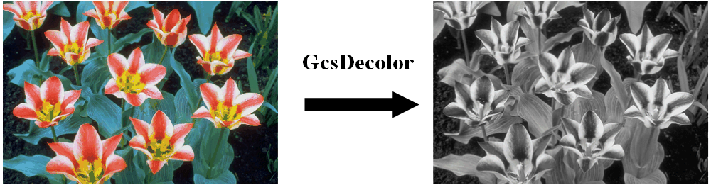
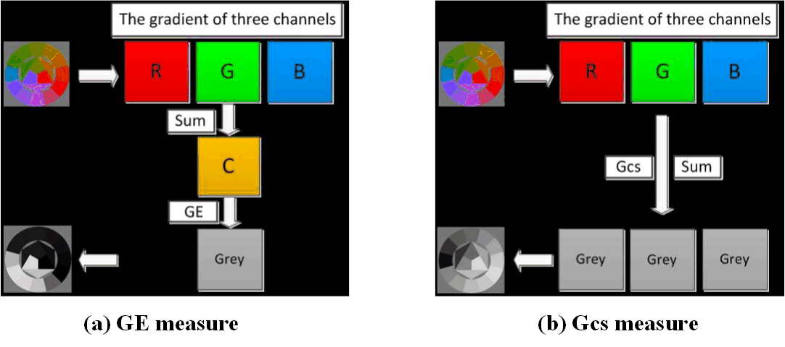

# GcsDecolor  
Gradient correlation similarity for efficient contrast preserving decolorization  
 
% The Code is created based on the method described in the following paper:  
% Q. Liu, P.X. Liu, W. Xie, Y. Wang, D. Liang, “GcsDecolor: Gradient correlation similarity for efficient contrast preserving decolorization,”  
% IEEE Trans. Image Process., vol. 24, no. 9, pp. 2889-2904, 2015.  
% Author: Q. Liu, P.X. Liu, W. Xie, Y. Wang, D. Liang    
% Date : 02/7/2016  
% Version : 1.0  
% The code and the algorithm are for non-comercial use only.  
% Copyright 2016, Department of Electronic Information Engineering, Nanchang University.  
% The current version is not optimized.  
% GcsDecolor2 - contrast preserving color-to-gray via Gradient correlation similarity   
% S = GcsDecolor2(Im, Lpp) performs contrast preserving decolorization on color image Im, with controling parameter Lpp    
%   
% Paras:    
% @Im : Input image (double), only color images are acceptable.    
% @Lpp : Controlling parameter defined in [1]. 0.25 by default.    
%    
% Example    
% ==========    
% Im = im2double(imread('23.png'));    
% gIm = GcsDecolor2(Im); % Default Parameters (Lpp = 0.25)   
% figure, imshow(Im), figure, imshow(gIm);    
  
## Demonstration of GcsDecolor  
     

## Flowchart of (a) the classical GE and (b) the proposed Gcs measures.
   

## Other Related Projects
  * Log-Euclidean Metrics for Contrast Preserving Decolorization
[**[Paper]**](https://ieeexplore.ieee.org/document/8016668)   [**[Code]**](https://github.com/yqx7150/LeDecolor)

  * Semiparametric Decolorization With Laplacian-Based Perceptual Quality Metric
[**[Paper]**](https://ieeexplore.ieee.org/document/7456206)   [**[Code]**](https://github.com/yqx7150/SPDecolor)

  * Variable augmented neural network for decolorization and multi-exposure fusion [**[Paper]**](https://www.sciencedirect.com/science/article/abs/pii/S1566253517305298)   [**[Code]**](https://github.com/yqx7150/DecolorNet_FusionNet_code)   [**[Slide]**](https://github.com/yqx7150/EDAEPRec/tree/master/Slide)

  * Color-to-gray Conversion on Wallpaper Dataset
[**[Dataset]**](https://github.com/yqx7150/DecolorNet_FusionNet_code/tree/master/Wallpapers_Dataset) 
